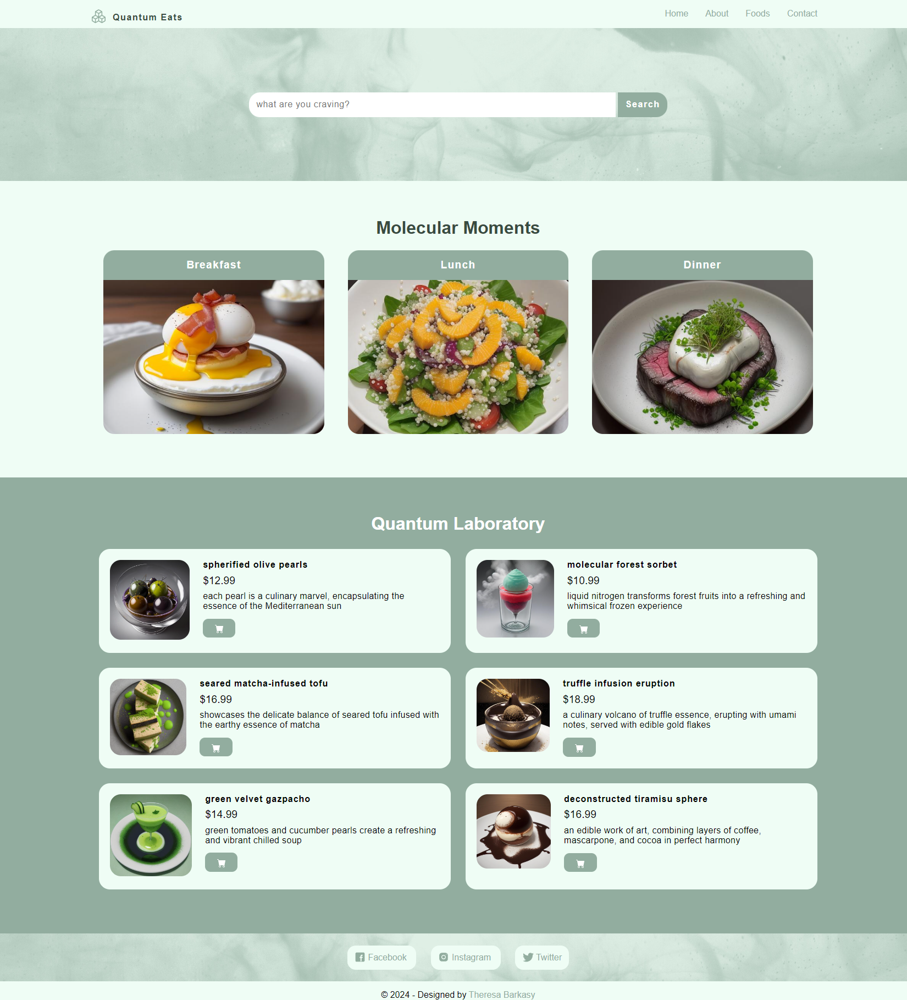
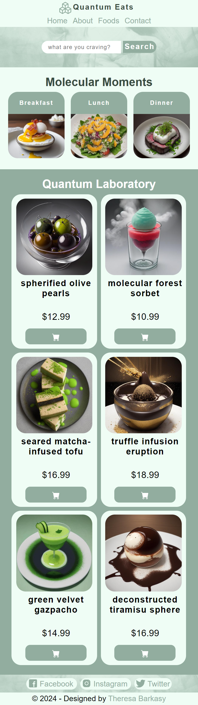

# Quantum Eats
> A molecular gastronomy restaurant website, built from scratch with HTML, CSS, PHP and MySQL.

## Features

<h3>&nbsp;Frontend Features:</h3>

 

<b>Interactive Menu:</b> Explore a curated menu of molecular gastronomy dishes, each with detailed descriptions and images.

<b>Order Placement:</b> Easily navigate through the menu to select and place orders for your desired dishes.

<b>Dynamic Navigation:</b> Seamless navigation between different food items, categories, and sections of the website.

<h3>&nbsp;Backend Features:</h3>

 
  
<b>Admin Management:</b> Add and delete admin users to manage website operations securely.

  
<b>Order Management:</b> View, manage, and track orders placed by customers in real time.
Update order statuses to keep customers informed about their order progress.

  
<b>Menu Management:</b> Add, update, and delete menu items with ease, allowing for flexibility in showcasing culinary creations. Organize menu items into categories for better navigation and presentation.

  
<b>Authentication:</b> Secure login system for admin users to access backend functionalities and perform administrative tasks.

<h3>&nbsp;Additional Features:</h3>

 
  
<b>Data Persistence:</b> Utilize databases to store and retrieve information about menu items, orders, and admin users for seamless data management.

  
<b>User-Friendly Interface:</b> Intuitive and responsive user interface design for both frontend and backend, ensuring a pleasant browsing and administrative experience.

  
<b>Customization Options:</b> Tailor the website's appearance and functionality according to your restaurant's branding and requirements.

  
<b>Security Measures:</b> Implement security measures to protect sensitive information and prevent unauthorized access to administrative features.

  
<b>Scalability:</b> Designed with scalability in mind, allowing for future enhancements and expansions as your restaurant grows.

## Screenshots
### Desktop Screen

### Mobile and Tablet Screen

## Special Thanks and Credits
<!-- Search Background -->
Texture created by [Ruvim Noga](https://unsplash.com/photos/blue-red-and-black-smoke-digital-wallpaper-pazM9TQJ2Ck)
Images created in tandem with [NightCafe](https://creator.nightcafe.studio/studio?gad_source=1&gclid=Cj0KCQiAkeSsBhDUARIsAK3tiefTHhVQ8K37DRBvgTOkNnGutCEnVwfhuzfUbjuPM8Z5NQLk45NXoosaAozNEALw_wcB)
  
  <!-- 
  Front End
  http://localhost/Quantum-Eats/index.html
  Back End
  http://localhost/Quantum-Eats/admin/ 
   -->
